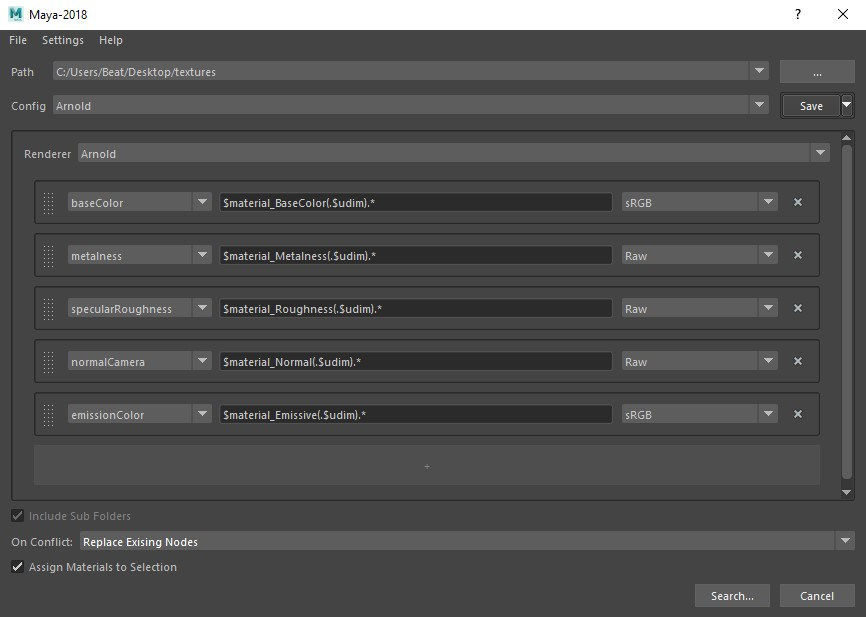

# texture-importer
A texture importer tool that creates material networks

## Installation for Maya

1. Click on the code button above and download the package as a .zip file.
2. Unpack the zip archive.
3. Drag the setup_maya.mel file into the viewport of maya.
4. This creates a button on the shelf that can be used to launch the tool.

If preferred the package can be installed manually by moving it into a location where the textureimporter directory can be loaded as a python package by maya. The tool can then be ran with the following code:
```
from textureimporter.plugins.maya import run
main_window = run()
```

## Configs

Configs are presets that store different patterns for texture names.


