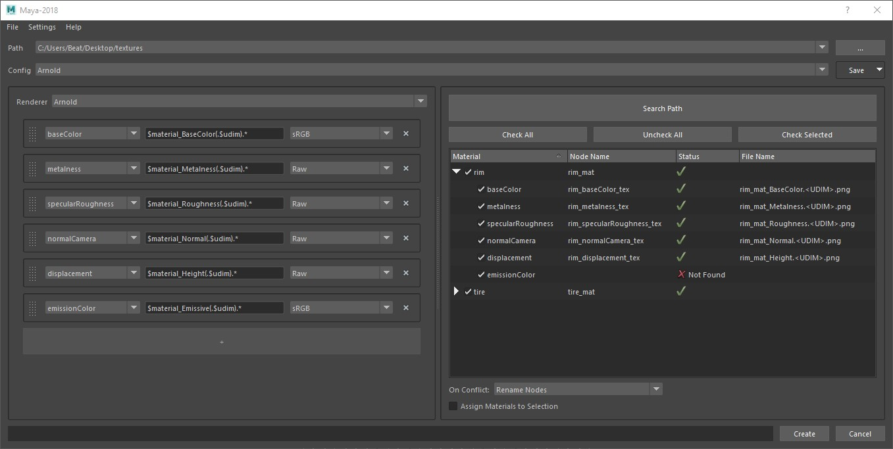

# texture-importer
Import texture files (Substance Painter, Mari, Mudbox, ...) into a dcc (maya, blender, 3dsMax...)\
Using customizable presets the tool searches a path for texture files and creates the material networks.\
[List of supported plugins](#supported-features)

## Installation for Maya
1. Click on the code button above and download the package as a .zip file.
2. Unpack the zip archive.
3. Drag the setup_maya.mel file into the viewport of maya.
4. This creates a button on the shelf that can be used to launch the tool.

If preferred the package can be installed manually by moving it the textureimporter directory into a location where it can be loaded as a python package by maya. The tool can then be ran with the following code:
```
from textureimporter.plugins.maya import run
main_window = run()
```

## Getting Started
1. Select a path with texture files.
2. Select a [Config](#configs).
3. Search the path for textures.
4. Check any nodes to be created.
5. Set any [Options](#options).
6. Create the material networks.



## Configs
Configs are presets that store different patterns for texture names. Configs can be organized in the menu next to the Save button and are available as .json files in the File menu. When importing textures from Substance Painter for example, just copy the same preset that is used there. Each config has a renderer associated with it and a set of channels that correspond to attributes on a material.\
After editing configs the network view can be maximized by moving the handle in the middle to the left.

### Wildcards
The pattern is used to search for file names in the specified path. Wildcards can be inserted with the right click menu.\
`$mesh`: When objects are selected, this will be replaced with each object name in the selection.\
`$material`: This is the material name and corresponds to $textureSet in Substance Painter.\
`$udim`: This is a wildcard for the udim syntax.\
`*`: The asterisk symbol is a wildcard for anything else.

Examples:
- `$mesh_BaseColor.jpg` will only find textures when an object or group is selected. With helmet selected: `helmet_BaseColor.jpg`
- `$material_BaseColor.*` works for both `Chrome_BaseColor.jpg` and `Chrome_BaseColor.png`

### Optional
To make a part of the pattern optional, use parentheses `( )`. To add different options use the pipe symbol `|` inside of parentheses such as `(jpg|png)`.

Examples:
- `$material_BaseColor(.$udim).png` will check for filenames that are either `Chrome_BaseColor.1001.png` or `Chrome_BaseColor.png`
- `$material_BaseColor.(tx|jpg|*)` will check for the `tx` extension first, then `jpg`, and lastly for any other extension.

## Options
### On Conflict
- Rename Nodes: If a node already exists with the given name, rename the new node.
- Remove Existing Nodes: If a node already exists with the given name, remove the existing nodes.
- Replace Existing Nodes with Connections: If a node already exists with the given name, attempt to remove the existing node but keep all connections.

### Assign Materials
If this option is checked, the tool will attempt material assignments in the following order:
1. If a material already exists with the name, transfer any material assignments to the new node.
2. If `$mesh` is used in the config, it will attempt to assign each material to the corresponding mesh.
3. The created material will be assigned to the selection.

## Settings
The important settings for the user are listed under `[general]` or the current dcc header such as `[maya]`.\
`num_crecent_paths`: The number of recent paths that are displayed\
`configs_path`: A custom path to store config files\
`*_node_pattern`: The pattern that is used to label that node. For example `{}_mat` will become `chrome_mat` or `M_{}_001` will become `M_chrome_001`

## Supported Features
The tool is built with a plugin system to easily extend the functionality to different dccs and renderers. Here is a list of currently supported features.

### DCCs
- [x] Maya
- [ ] 3ds Max
- [ ] Blender

### Renderer
- [x] maya-arnold
- [x] maya-vray
- [x] maya-redshift
- [ ] maya-renderman
- [ ] max-arnold
- [ ] max-vray

### Texture Formats
- [x] Substance Painter
- [x] Mari
- [ ] Mudbox
